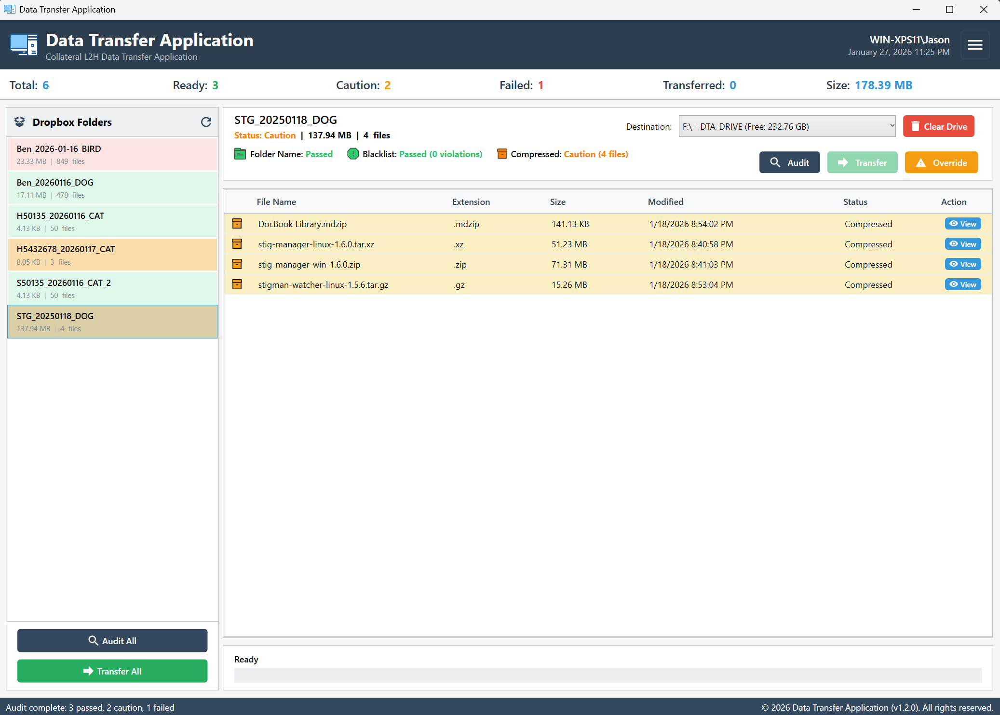

  
  Data Transfer Application (.NET)

A secure, user-friendly application for transferring data between air-gapped systems with comprehensive audit trails and compliance documentation.

  

## ✨ Key Features

- **🔒 Secure Air-Gapped Transfers** - No network connectivity required
- **📁 Folder Auditing** - Validates folder naming and file contents
- **📊 Real-Time Progress** - Live transfer progress with detailed statistics
- **📋 Compliance Records** - Automatic generation of audit trails in multiple formats
- **🗂️ Archive Support** - Handles ZIP, RAR, 7Z, TAR, and other archive formats
- **⚙️ Configurable Settings** - Customize paths, validation rules, and logging
- **📈 Transfer History** - Complete database of all past transfers
- **🎯 Dataset Validation** - Ensures only authorized datasets are transferred

## 🚀 Quick Start

### System Requirements

- Windows 10/11
- .NET 10.0 Runtime (automatically installed if needed)
- 100MB free disk space

### Installation

1. Download the latest release from the releases page
2. Extract the ZIP file to your preferred location
3. Run `DataTransferApp.Net.exe`

The application will automatically create its data directory in `%AppData%\DataTransferApp\`.

## 📖 How to Use

### 1. Initial Setup

- Launch the application
- Configure your staging and destination paths in Settings
- Set up folder naming patterns and file validation rules

### 2. Prepare Data for Transfer

- Place folders in the staging directory following your naming convention
- The application will automatically detect and validate folders

### 3. Audit and Transfer

- Click **Refresh** to scan for available folders
- Review audit results for each folder
- Select folders and click **Transfer** to move data to destination drives
- Monitor progress in real-time

### 4. Compliance Documentation

- Compliance records are automatically generated for each transfer
- Available in CSV, Excel, TXT, and JSON formats
- Stored alongside transfer data for easy access

## ⚙️ Configuration

Access settings through the **Settings** button in the main window:

### Paths

- **Staging Directory**: Where you place folders for transfer
- **Destination Drives**: Network or external drives for data transfer
- **Retention Directory**: Long-term storage location

### Validation Rules

- **Folder Naming Pattern**: Regex for valid folder names (e.g., `Employee_YYYY-MM-DD_Dataset`)
- **File Extension Blacklist**: Prohibited file types
- **Dataset Whitelist**: Authorized dataset codes

### Transfer Options

- **Calculate File Hashes**: Enable for data integrity verification
- **Compression**: Reduce transfer size for large datasets
- **Concurrent Operations**: Speed up transfers with parallel processing

## 📊 Transfer History

View complete transfer history with:

- Transfer dates and times
- File counts and sizes
- Success/failure status
- Compliance record links
- Detailed file listings

## 🔒 Security & Compliance

- **Air-Gapped Design**: No network connectivity prevents data leaks
- **Audit Trails**: Every transfer is logged with file hashes and metadata
- **Path Validation**: Prevents directory traversal attacks
- **File Type Control**: Configurable restrictions on file extensions
- **Dataset Authorization**: Only approved datasets can be transferred

## 🆘 Troubleshooting

### Common Issues

**"Drive not ready" errors**

- Ensure destination drives are properly connected and formatted
- Check drive letters in Settings match available drives

**"Invalid folder name" errors**

- Verify folder names match the configured regex pattern
- Check Settings > Validation Rules for naming requirements

**Application won't start**

- Ensure .NET 8.0 runtime is installed
- Check Windows Event Viewer for error details
- Verify write permissions to `%AppData%\DataTransferApp\`

**Slow transfers**

- Enable compression in Settings for large files
- Consider increasing concurrent operations limit
- Check destination drive performance

### Logs and Support

- Application logs are stored in `%AppData%\DataTransferApp\Logs\`
- Include log files when reporting issues
- Check the [Troubleshooting Guide](docs/TROUBLESHOOTING.md) for detailed solutions

## 📋 Recent Updates

### Version 1.3.2 (January 30, 2026)

- **Bug Fixes**: Resolved issues with file hash calculation for large files
- **UI Improvements**: Enhanced progress bar animations and status indicators
- **Export Enhancements**: Added PDF export option for compliance reports
- **Security Updates**: Improved path validation to prevent directory traversal
- **Performance**: Optimized memory usage during bulk file operations

### Version 1.3.0 (January 28, 2026)

- **Enhanced File Detection**: Improved text file identification with special handling for .md files
- **File Viewer Coverage**: Better detection of viewable files using content analysis
- **Archive Support**: Archives are properly marked as viewable for content browsing
- **Performance Optimizations**: Sample-based file reading for faster detection

### Version 1.2.0 (January 21, 2026)

- **Transfer History Database**: Centralized storage with 50-200x performance improvement
- **Automated Compliance Records**: CSV/Excel generation for every transfer
- **Multi-User Support**: Shared database for team collaboration
- **Migration Tools**: Import existing transfer logs

### Version 1.1.0 (January 17, 2026)

- **Archive File Support**: Preview and validate compressed files
- **Enhanced Validation**: Improved folder naming and file type checking
- **Progress Reporting**: Real-time transfer statistics
- **Settings Persistence**: All configuration saved automatically

## 📞 Support

For technical support or questions:

- Check the [User Guide](docs/USER_GUIDE.md) for detailed instructions
- Review [Troubleshooting](docs/TROUBLESHOOTING.md) for common solutions
- Contact your system administrator for configuration assistance

---

**Version**: 1.4.1
**Last Updated**: February 10, 2026  
**Framework**: .NET 8.0  
**UI**: WPF with MVVM
